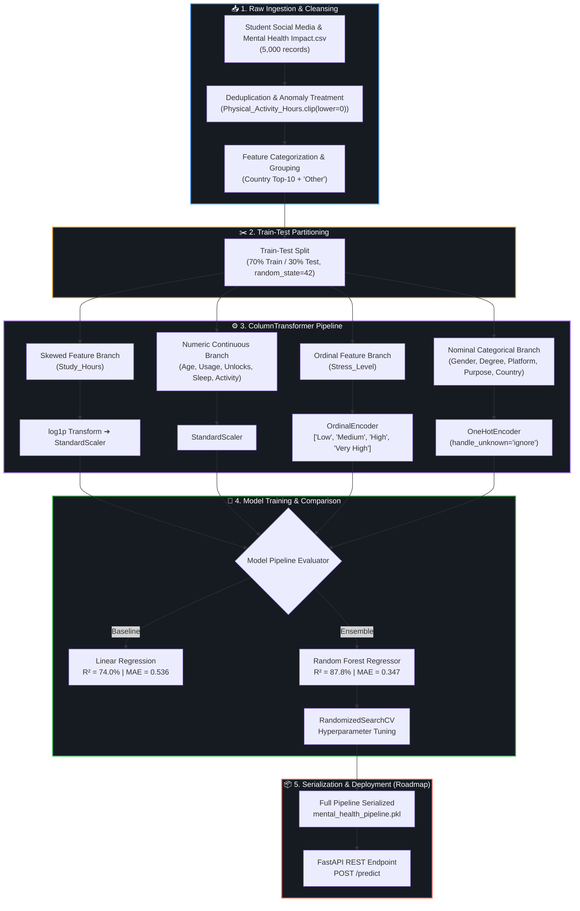
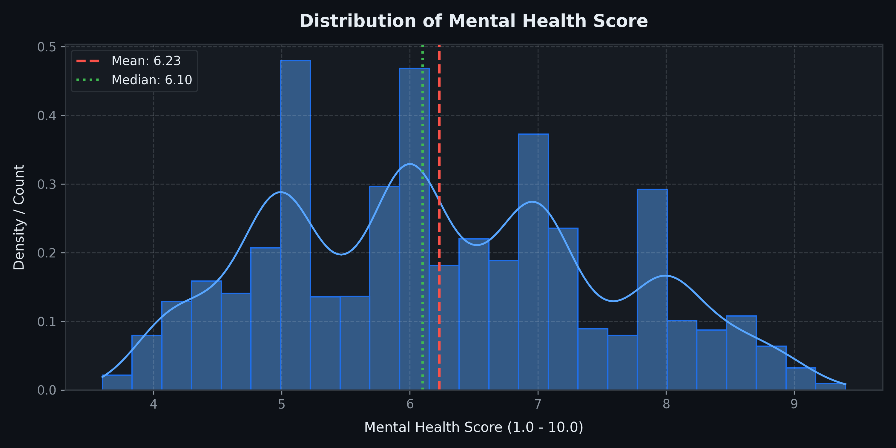
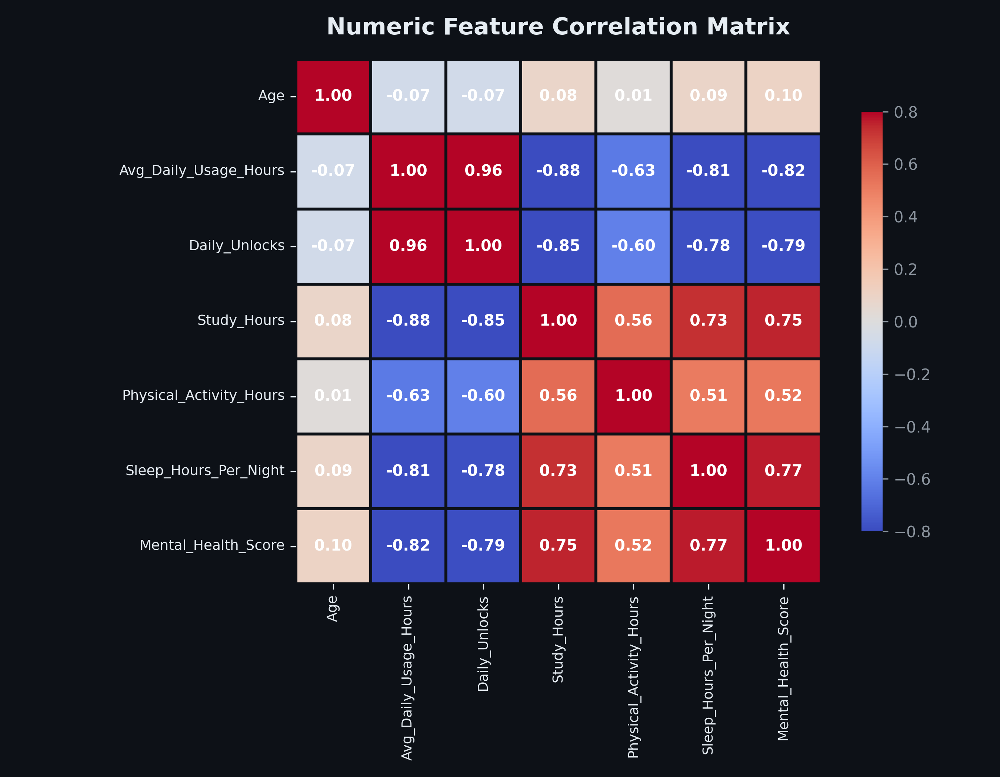
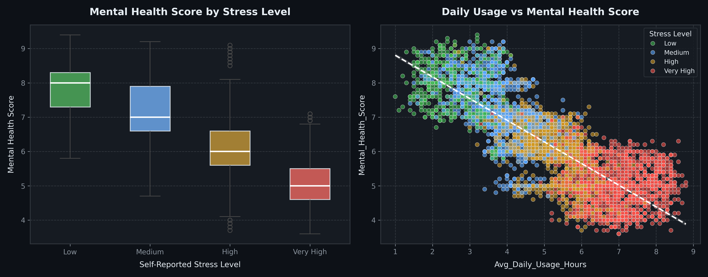
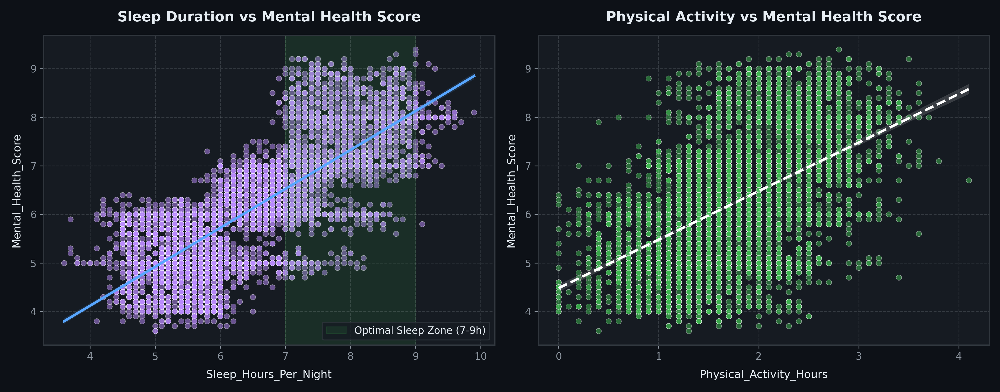
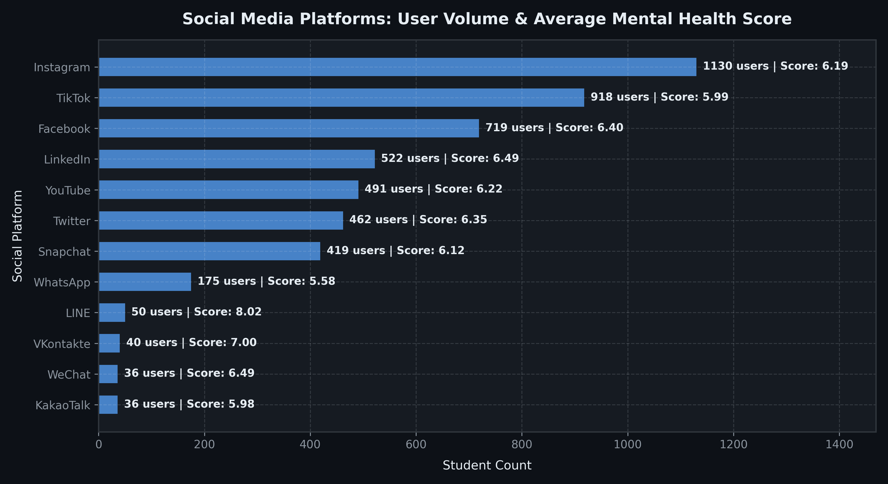
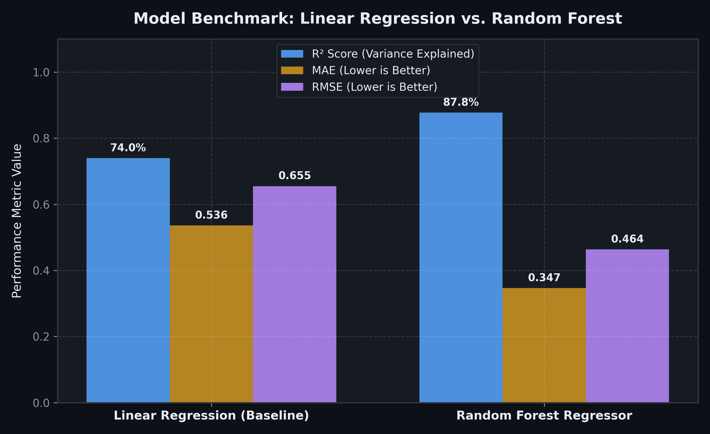

<div align="center">

# 🧠 Student Mental Health Score Predictor
### *Data-Driven Behavioral Analytics & Machine Learning Pipeline*

[](https://www.python.org/)
[](https://scikit-learn.org/)
[](https://pandas.pydata.org/)
[](https://numpy.org/)
[](https://seaborn.pydata.org/)
[](https://github.com/Vaidik-Pipaliya/Mental-Health-Score-Predictor-Machine_Learning-)

<p align="center">
  <strong>An end-to-end Machine Learning system that quantifies and predicts student mental health scores based on daily social media consumption patterns, device interactions, academic commitments, and lifestyle indicators.</strong>
</p>

[Explore Dataset](#-dataset-overview) • [Pipeline Architecture](#-pipeline-architecture) • [Visual EDA](#-exploratory-data-analysis--visualizations) • [Model Benchmark](#-model-benchmarks--evaluation) • [Getting Started](#-getting-started)

---

</div>

## 📌 Executive Summary

Modern students navigate an increasingly digital existence where excessive social media engagement, device unlock compulsion, and irregular sleep cycles frequently clash with academic demands. 

This project explores the quantifiable relationship between lifestyle/digital consumption variables and a standardized **Mental Health Score (scale: 1.0 – 10.0)** across a diverse cohort of **5,000 students**. 

By employing robust statistical preprocessing, skewness correction, and scikit-learn composite `Pipeline` architectures, the system progresses from foundational statistical baselines (`LinearRegression` at **$R^2 = 74.0\%$**) to non-linear ensemble models (`RandomForestRegressor` achieving **$R^2 = 87.8\%$** and an **MAE of 0.347**).

---

## ⚡ Quick Highlights

| Metric / Aspect | Value / Specification | Description |
| :--- | :--- | :--- |
| 📊 **Dataset Volume** | 5,000 Records × 13 Features | Cleaned demographic, behavioral, & psychological survey |
| 🎯 **Target Metric** | `Mental_Health_Score` | Continuous score from $3.60$ to $9.40$ ($\mu = 6.23, \sigma = 1.28$) |
| 🛡️ **Leakage Protection** | Scikit-Learn `ColumnTransformer` | All scaling & encoders fitted strictly inside train splits |
| 🌲 **Top Performing Model** | `RandomForestRegressor` | **$87.8\%$ Test $R^2$**, MAE $= 0.347$, RMSE $= 0.464$ |
| 📈 **Baseline Comparison** | `LinearRegression` | **$74.0\%$ Test $R^2$**, MAE $= 0.536$, RMSE $= 0.655$ |
| 🚀 **Deployment Goal (Part 2)**| FastAPI + Pydantic | Scalable REST API with self-contained pipeline pickle |

---

## 🏗️ Pipeline Architecture



---

## 📊 Dataset Overview

The dataset (`Student Social Media And Mental Health Impact.csv`) captures digital usage habits and physiological wellness indicators among secondary and tertiary education students:

| Feature Name | Type | Unit / Scale | Description |
| :--- | :--- | :--- | :--- |
| `Age` | Numerical | Years ($18 - 24$) | Age of the surveyed student |
| `Gender` | Categorical | Binary | Self-reported gender (`Male`, `Female`) |
| `Country` | Categorical | 111 Countries | Student nationality (transformed into Top-10 + `Other`) |
| `Academic_Level` | Categorical | 3 Tiers | `High School`, `Undergraduate`, `Graduate` |
| `Most_Used_Platform` | Categorical | 12 Platforms | Instagram, TikTok, Facebook, YouTube, Twitter, LinkedIn, etc. |
| `Purpose_Of_Use` | Categorical | 4 Intents | `Entertainment`, `Education`, `Networking`, `News` |
| `Avg_Daily_Usage_Hours` | Numerical | Hours ($1.0 - 8.8$) | Total daily duration spent across social media applications |
| `Daily_Unlocks` | Numerical | Count ($62 - 273$) | Frequency of device lock-screen access events per 24 hours |
| `Study_Hours` | Numerical | Hours ($0.3 - 8.3$) | Dedicated daily non-screen study and focus time |
| `Physical_Activity_Hours`| Numerical | Hours ($0.0 - 4.1$) | Daily athletic, gym, or cardiovascular exercise |
| `Sleep_Hours_Per_Night` | Numerical | Hours ($3.6 - 9.9$) | Self-reported nocturnal sleep duration |
| `Stress_Level` | Ordinal | 4 Ranks | `Low` < `Medium` < `High` < `Very High` |
| **`Mental_Health_Score`** | **Target (Num)** | **Score ($1.0 - 10.0$)** | **Standardized mental wellbeing score (Continuous target)** |

---

## 📈 Exploratory Data Analysis & Visualizations

### 1. Target Distribution (`Mental_Health_Score`)
The mental health target score shows a well-calibrated distribution across the cohort with a mean of **$6.23$** and a median of **$6.10$**, spanning from $3.60$ to $9.40$.

<p align="center">
  
</p>

> **Key Observation:** The distribution is balanced with moderate variance ($\sigma = 1.28$), making it an ideal candidate for regression modeling without requiring artificial synthetic oversampling or heavy clipping.

---

### 2. Feature Correlation Matrix
An examination of Pearson correlations reveals which behaviors most strongly govern student psychological health.

<p align="center">
  
</p>

> **Key Takeaways:**
> - **Strong Negative Drivers:** `Avg_Daily_Usage_Hours` ($-0.82$) and `Daily_Unlocks` ($-0.79$) exhibit fierce inverse relationships with mental health.
> - **Strong Protective Factors:** `Sleep_Hours_Per_Night` ($+0.77$), `Study_Hours` ($+0.75$), and `Physical_Activity_Hours` ($+0.52$) strongly correlate with higher mental wellbeing.
> - **Device Compulsion:** `Daily_Unlocks` and `Avg_Daily_Usage_Hours` are heavily co-linear ($+0.96$), showing that frequent device activation directly mirrors excessive screen consumption.

---

### 3. Stress Level & Screen Time Impact
Visualizing the combined interaction of self-reported stress and daily hours spent on digital apps:

<p align="center">
  
</p>

> **Key Takeaways:**
> - **Stress Stratification:** Students with `Low` stress maintain a median mental health score around $\approx 8.0$, whereas `Very High` stress students drop to a median of $\approx 5.0$.
> - **Critical Threshold:** A steep linear degradation manifests once daily social media consumption exceeds **$5.0 - 5.5$ hours/day**. Students exceeding $7$ hours almost uniformly register in the highest stress tiers with mental health scores below $5.5$.

---

### 4. Lifestyle Balance: Sleep & Physical Activity
Evaluating nocturnal rest and physical exercise against mental wellness scores:

<p align="center">
  
</p>

> **Key Takeaways:**
> - **The Optimal Sleep Zone ($7 - 9$ Hours):** The left plot highlights that students reaching $7.0$ to $9.0$ hours of sleep per night regularly achieve scores above $7.5$. Sleep deprivation ($< 5$ hours) strongly suppresses scores below $5.5$.
> - **Physical Activity:** Even $1.5 - 2.5$ hours of daily movement provides a significant positive buffer against mental fatigue.

---

### 5. Platform Breakdown & Engagement Volume
Distribution of primary social platforms used by students alongside their average mental health score:

<p align="center">
  
</p>

> **Key Takeaways:**
> - **Volume Leaders:** `Instagram` ($1,130$ students) and `TikTok` ($918$ students) dominate student adoption.
> - **Relative Health Indexes:** Short-form, algorithmically intense video platforms (`TikTok`: $5.99$, `WhatsApp`: $5.58$, `Snapchat`: $6.12$) exhibit lower average mental scores compared to utility or network-oriented applications (`LinkedIn`: $6.49$, `Facebook`: $6.40$, `LINE`: $8.02$).

---

## 🛠️ Data Preprocessing & Pipeline Construction

To guarantee zero data leakage between training and testing splits, all transformations are orchestrated through Scikit-Learn's `ColumnTransformer` and composite `Pipeline`:

```python
from sklearn.pipeline import Pipeline
from sklearn.compose import ColumnTransformer
from sklearn.preprocessing import FunctionTransformer, StandardScaler, OrdinalEncoder, OneHotEncoder

# 1. Skewed numerical features (e.g. Study_Hours)
skewed_pipeline = Pipeline([
    ('log_transform', FunctionTransformer(np.log1p)),
    ('scale', StandardScaler())
])

# 2. Continuous numerical features (Age, Screen Time, Unlocks, Sleep, Activity)
plain_numeric_pipeline = Pipeline([
    ('scale', StandardScaler())
])

# 3. Ordinal features with inherent hierarchy
ordinal_pipeline = Pipeline([
    ('encode', OrdinalEncoder(categories=[['Low', 'Medium', 'High', 'Very High']]))
])

# 4. Nominal categorical features (Gender, Academic Level, Platform, Purpose, Country)
nominal_pipeline = Pipeline([
    ('encode', OneHotEncoder(handle_unknown='ignore'))
])

# Composite Column Transformer
preprocessor = ColumnTransformer(transformers=[
    ("Skewed_Pipeline", skewed_pipeline, ['Study_Hours']),
    ("Plain_Numeric", plain_numeric_pipeline, other_numeric_cols),
    ("Ordinal", ordinal_pipeline, ['Stress_Level']),
    ("Normal", nominal_pipeline, nominal_cols)
])
```

### Why This Design Matters:
1. **Zero Data Leakage:** Preprocessing statistics ($\mu$, $\sigma$, one-hot dictionaries) are computed strictly on $X_{train}$ and transferred to $X_{test}$ via `.transform()`.
2. **Production Ready:** When exposed via a FastAPI endpoint, the backend accepts raw JSON dictionaries directly without needing any manual feature transformation code.

---

## 🔬 Model Benchmarks & Evaluation

Two primary paradigms were constructed and compared on identical $70/30$ train/test partitions:

<p align="center">
  
</p>

### Detailed Performance Scoreboard

| Model Architecture | Training $R^2$ | Testing $R^2$ | Test MAE | Test RMSE | Inference Efficiency |
| :--- | :---: | :---: | :---: | :---: | :---: |
| **Linear Regression (Baseline)** | $72.37\%$ | **$73.98\%$** | $0.5362$ | $0.6551$ | $< 1\text{ ms}$ |
| **Random Forest Regressor** | $98.08\%$ | **$87.76\%$** | **$0.3472$** | **$0.4637$** | $\approx 15\text{ ms}$ |

### Evaluation Insights:
- **Ensemble Dominance:** `RandomForestRegressor` improves variance explanation by **$+13.78\%$** ($R^2 = 87.76\%$) over linear regression, dropping mean absolute error down to **$0.347$ score points**.
- **Non-Linear Interactions:** Non-linear decision trees capture intricate threshold effects (such as the sudden steep penalty when daily usage exceeds $5$ hours combined with sleep deprivation).

---

## 📂 Project Structure

```bash
Mental-Health-Score-Predictor-Machine_Learning-/
├── assets/                                      # Publication-grade visualization assets
│   ├── correlation_heatmap.png                  # Pearson correlation matrix
│   ├── lifestyle_factors.png                    # Sleep & physical activity vs mental health
│   ├── model_comparison.png                     # Model benchmark visual scoreboard
│   ├── platform_breakdown.png                   # Platform popularity & average scores
│   ├── stress_and_usage.png                     # Stress levels & screen time scatter
│   └── target_distribution.png                  # Mental health score density plot
├── ML_Project.ipynb                             # Core Jupyter Notebook (EDA, Pipeline, Models)
├── Student Social Media And Mental Health Impact.csv  # 5,000-record dataset
├── .gitignore                                   # Explicit exclusions (.pkl, solution nb, html)
└── README.md                                    # Comprehensive project documentation
```

---

## 🚀 Getting Started

### 1. Clone the Repository
```bash
git clone https://github.com/Vaidik-Pipaliya/Mental-Health-Score-Predictor-Machine_Learning-.git
cd Mental-Health-Score-Predictor-Machine_Learning-
```

### 2. Set Up a Virtual Environment
```bash
# Windows (PowerShell)
python -m venv venv
.\venv\Scripts\Activate.ps1

# Linux / macOS
python3 -m venv venv
source venv/bin/activate
```

### 3. Install Dependencies
```bash
pip install numpy pandas matplotlib seaborn scikit-learn jupyter
```

### 4. Run the Jupyter Notebook
```bash
jupyter notebook ML_Project.ipynb
```

---

## 🗺️ Project Roadmap

- [x] **Phase 1: Exploratory Data Analysis & Statistical Auditing**
  - [x] Missing value & outlier detection
  - [x] High-resolution visualization generation
  - [x] Multi-factor correlation studies
- [x] **Phase 2: Scikit-Learn Pipeline Engineering**
  - [x] `ColumnTransformer` with multi-path encoding & scaling
  - [x] Logarithmic skewness handling (`np.log1p`)
  - [x] Train-Test isolation
- [x] **Phase 3: Machine Learning Model Construction**
  - [x] Baseline `LinearRegression` pipeline ($R^2 = 74.0\%$)
  - [x] Ensemble `RandomForestRegressor` pipeline ($R^2 = 87.8\%$)
  - [x] Hyperparameter exploration via `RandomizedSearchCV`
- [ ] **Phase 4: Productionization & Serving (Part 2)**
  - [ ] Pipeline export to standalone `.joblib` / `.pkl` bundle
  - [ ] FastAPI backend microservice with Pydantic payload validation
  - [ ] Interactive Streamlit or React web dashboard for instant self-assessment
  - [ ] Model explainability using SHAP (SHapley Additive exPlanations)

---

## 👨‍💻 Author & Maintainer

Developed by **[Vaidik Pipaliya](https://github.com/Vaidik-Pipaliya)**  
*AI & Machine Learning Enthusiast*

If you find this repository insightful or educational, feel free to give it a ⭐ on GitHub!
